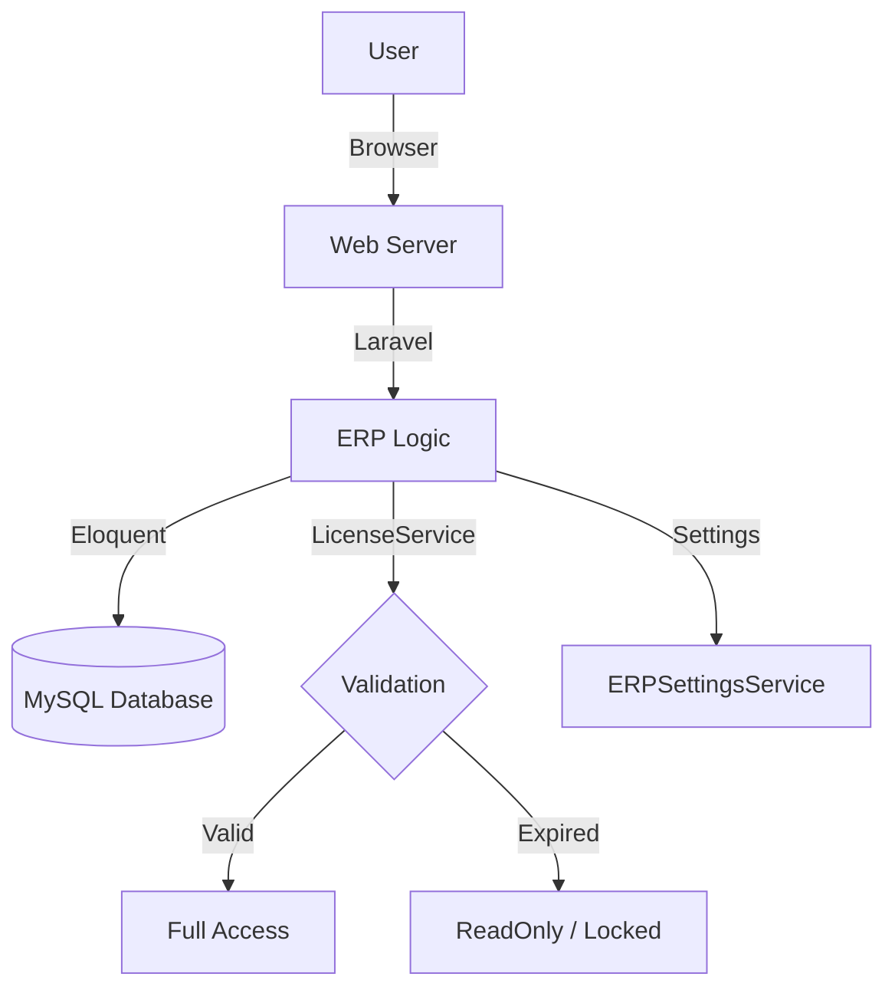

# 🚀 ERP PRO X Setup Guide

Welcome to the premium setup guide for **ERP PRO X**. Follow these steps to get your system up and running in minutes.

---

## 🛠️ Prerequisites

Before you begin, ensure you have the following installed:
- **PHP 8.2+** with extensions: `pdo_mysql`, `bcmath`, `gd`, `intl`, `mbstring`, `xml`, `openssl`.
- **MySQL 8.0+** or **MariaDB**.
- **Composer** (for dependency management).
- **Node.js & NPM** (for frontend assets).

---

## ⚡ Method 1: One-Click CLI Setup (Recommended)

The fastest way to install the system is using our unified CLI tool.

1. Open your terminal in the project root.
2. Run the following command:
   ```bash
   php setup_unified.php
   ```
3. Follow the interactive prompts to configure your database.
4. Once completed, your system will be ready at `http://localhost`.

---

## 🌐 Method 2: Web-Based Setup Wizard

If you prefer a visual interface, you can use the built-in Setup Wizard.

1. Start your local server:
   ```bash
   php artisan serve
   ```
2. Open `http://localhost:8000` in your browser.
3. You will be automatically redirected to the **Setup Wizard**.
4. Follow the **9-Step Process**:
   - **Step 1-3**: Database, Company, and Admin account setup.
   - **Step 4-7**: Edition selection and feature configuration.
   - **Step 8-9**: Review and License activation.

---

## 🔑 License Key Generation

To activate your system, you need a 24-digit numeric license key.

1. Navigate to `tools/keygen/`.
2. Run the Key Generator:
   ```bash
   python keygen.py
   ```
3. Select your **Edition** (Standard, Performance, Business, or X).
4. Set the **Validity Period**.
5. Click **Generate** and copy the key into the Setup Wizard or System Settings.

---

## 📋 Default Credentials

After a fresh installation, use these credentials:

| Field | Value |
| :--- | :--- |
| **Email** | `Admin@ERPPRO.Site` |
| **Password** | `admin123` |

> [!IMPORTANT]
> For security, change the default password immediately after your first login.

---

## 📂 System Architecture



---

## 🆘 Troubleshooting

- **Database Connection Error**: Verify your credentials in the `.env` file.
- **Permission Denied**: Ensure the `storage` and `bootstrap/cache` directories are writable.
- **License Invalid**: Ensure you are using the 24-digit numeric format generated by the new `keygen.py`.

> [!TIP]
> If you encounter issues with frontend assets, run `npm install && npm run dev` to rebuild them.
